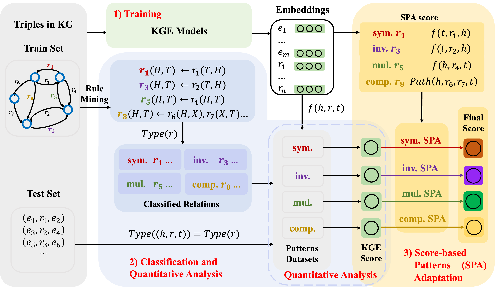

# Quantitative analysis over relational patterns and SPA
### This repository contains code for:
-*A Comprehensive Study on Knowledge Graph Embedding over Relational Patterns Based on Rule Learning*

## Model Architecture
<h3 align="center">
    
</h3>


## Dependencies

- ```Python 3```
- ```Java >= 8```
- ```ipython==8.4.0```
- ```numpy==1.19.5```
- ```pytorch_lightning==1.5.10```
- ```PyYAML==6.0```
- ```requests==2.25.1```
- ```torch==1.8.0```
- ```tqdm==4.61.2```
- ```wandb==0.12.21```
- All experiments are performed with one RTX 3090 GPU.

## Usage
- `src/`:
    - `SPA/`: include SPA codes.
- `dataset/`: 
    - `dataset/FB15K237/`: FB15k-237 dataset resources
    - `dataset/WN18RR/`: WN18RR dataset resources
    - `dataset/amie3.jar`: rule mining tool AMIE3
    - `dataset/classify.py`: Quantitative analysis over relational patterns
- `output/`: 
    - `output/link_prediciton/FB15K237/`: model outputs for FB15k-237 dataset
    - `output/link_prediciton/WN18RR/`: model outputs for WN18RR dataset
- `logging/`: include train logging files.
- `scripts/`: include train and SPA shell files.
- `quantitative_analysis.py`: Quantitative analysis over relational patterns 
- `readme.md`: Help

## Training and Testing

**Step1** Create a virtual environment using ```Anaconda``` and enter it
```bash
conda create -n spa python=3.8
conda activate spa
```

**Step2** Install package
```bash
pip install torch==1.9.1+cu111 -f https://download.pytorch.org/whl/torch_stable.html
pip install -r requirements.txt

```

**Step3** Classify relations and triples with AMIE3
```bash
# python dataset/classify.py arg1 arg2 arg3
# arg1 is the dataset be chosen which FB15k237 and WN18RR are available
# arg2 is the PCA with AMIE3
# arg3 is the HC  with AMIE3
python dataset/classify.py FB15k237 0.8 0.5

```

**Step4** Train and test KGE model
```bash
# FB15k-237
sh scripts/FreeBase/TransE_FB.sh
sh scripts/FreeBase/RotatE_FB.sh
sh scripts/FreeBase/HAKE_FB.sh
sh scripts/FreeBase/DistMult_FB.sh
sh scripts/FreeBase/ComplEx_FB.sh
sh scripts/FreeBase/DualE_FB.sh
sh scripts/FreeBase/PairRE_FB.sh
```

```bash
# WN18RR
sh scripts/WordNet/TransE_WN.sh
sh scripts/WordNet/RotatE_WN.sh
sh scripts/WordNet/HAKE_WN.sh
sh scripts/WordNet/DistMult_WN.sh
sh scripts/WordNet/ComplEx_WN.sh
sh scripts/WordNet/DualE_WN.sh
sh scripts/WordNet/PairRE_WN.sh
```

**Step5** Quantitative analysis over relational patterns
```bash
python quantitative_analysis.py
```

**Step6** Combine KGE socre with SPA score
```bash
# FB15k-237
sh scripts/FreeBase_SPA/TransE_FB.sh
sh scripts/FreeBase_SPA/RotatE_FB.sh
sh scripts/FreeBase_SPA/HAKE_FB.sh
sh scripts/FreeBase_SPA/DistMult_FB.sh
sh scripts/FreeBase_SPA/ComplEx_FB.sh
sh scripts/FreeBase_SPA/DualE_FB.sh
sh scripts/FreeBase_SPA/PairRE_FB.sh
```

```bash
# WN18RR
sh scripts/WordNet_SPA/TransE_WN.sh
sh scripts/WordNet_SPA/RotatE_WN.sh
sh scripts/WordNet_SPA/HAKE_WN.sh
sh scripts/WordNet_SPA/DistMult_WN.sh
sh scripts/WordNet_SPA/ComplEx_WN.sh
sh scripts/WordNet_SPA/DualE_WN.sh
sh scripts/WordNet_SPA/PairRE_WN.sh
```

**Note**: 
- Default `.sh` files have been set the best hyperparameters, you can open the `.sh` file for parameter</a> modification.
- Before combining KGE socre with SPA score, please make sure the path of trained model is correct on `checkpoint_dir`.
- To obtain the SPA results under different relational patterns, you need to first replace the data in the test dataset with the data under the patterns dataset.
```bash
# FB15k-237 with symmetric 
cat dataset/FB15K237/relation_classify/minhc_0.5_minpca_0.8_maxad_4/symmetric/num_constrain_0.txt > dataset/FB15K237/test.txt
# FB15k-237 with inverse 
cat dataset/FB15K237/relation_classify/minhc_0.5_minpca_0.8_maxad_4/inverse/num_constrain_0.txt > dataset/FB15K237/test.txt
# FB15k-237 with multiple 
cat dataset/FB15K237/relation_classify/minhc_0.5_minpca_0.8_maxad_4/multiple/num_constrain_0.txt > dataset/FB15K237/test.txt
# FB15k-237 with compositional 
cat dataset/FB15K237/relation_classify/minhc_0.5_minpca_0.8_maxad_4/compose2/num_constrain_0.txt > dataset/FB15K237/test.txt

# WN18RR with symmetric 
cat dataset/WN18RR/relation_classify/minhc_0.5_minpca_0.8_maxad_4/symmetric/num_constrain_0.txt > dataset/WN18RR/test.txt
# WN18RR with inverse 
cat dataset/WN18RR/relation_classify/minhc_0.5_minpca_0.8_maxad_4/inverse/num_constrain_0.txt > dataset/WN18RR/test.txt
# WN18RR with multiple 
cat dataset/WN18RR/relation_classify/minhc_0.5_minpca_0.8_maxad_4/multiple/num_constrain_0.txt > dataset/WN18RR/test.txt
# WN18RR with compositional 
cat dataset/WN18RR/relation_classify/minhc_0.5_minpca_0.8_maxad_4/compose2/num_constrain_0.txt > dataset/WN18RR/test.txt
```
- Run SPA  `.sh` files need to match the test pattern data with the pattern of the SPA. For example, if you want to get SPA result with TransE over symmetric pattern in FB15k237, you can execute the following command.
```bash
# first change to the symmetric dataset
cat dataset/FB15K237/relation_classify/minhc_0.5_minpca_0.8_maxad_4/symmetric/num_constrain_0.txt > dataset/FB15K237/test.txt
```
Then set the use_sym_weight and lambda_sym in scripts/FreeBase_SPA/TransE_FB.sh
